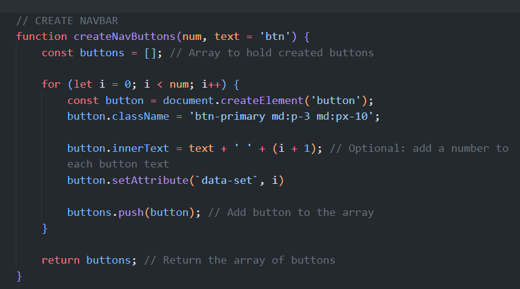
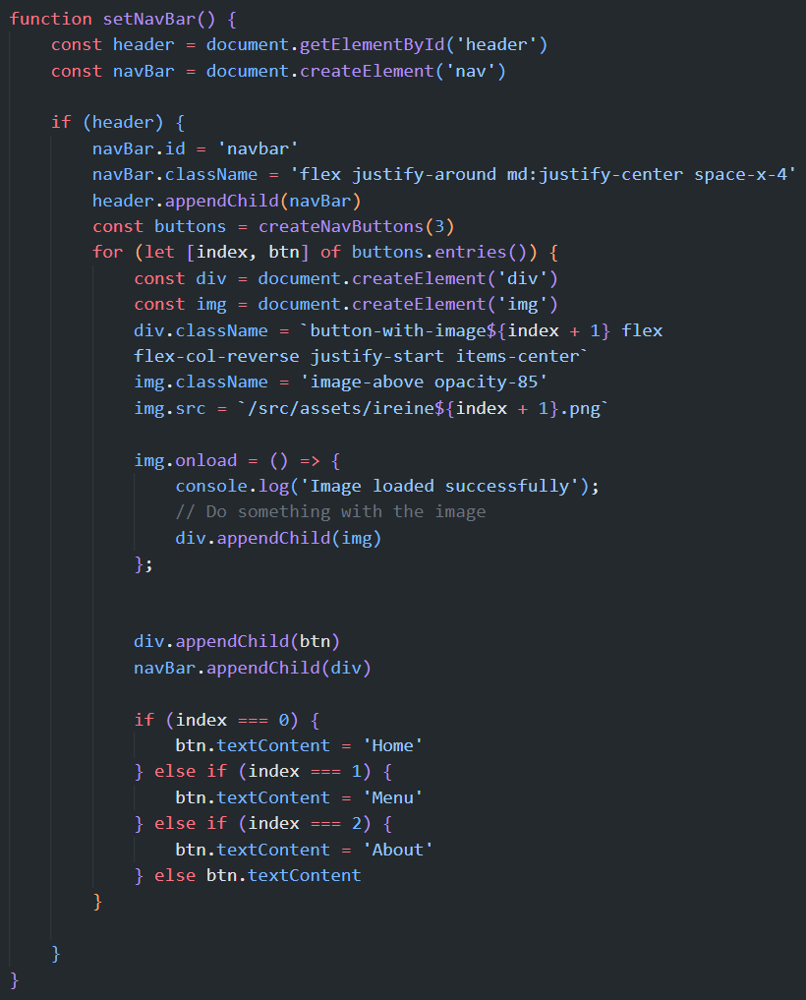
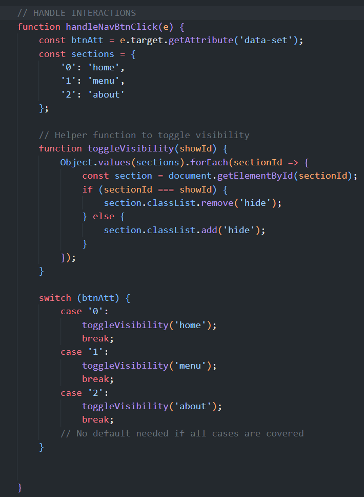
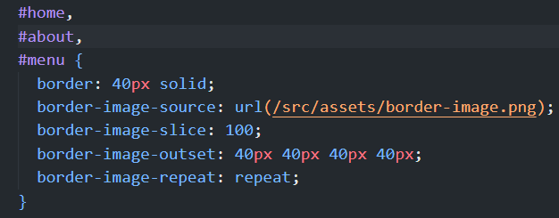

# Ireine's shop!

## Overview

This project is a modern, modular front-end application designed to showcase my abilities in organizing and building complex web applications. Utilizing Webpack 5, it demonstrates efficient code bundling, dynamic asset management, and seamless integration of modern CSS frameworks like Tailwind CSS for responsive and visually appealing designs.

## Features

- **Modular JavaScript**: Organized codebase using JavaScript modules to ensure scalability and maintainability.
- **Webpack 5**: Advanced bundling of assets, scripts, and styles to optimize loading times and performance.
- **HTML Loader**: Bundles HTML files into the `dist` folder, enabling a streamlined development workflow.
- **CSS Loader & PostCSS**: Facilitates the use of modern CSS features and integrates Tailwind CSS for utility-first styling.
- **Responsive Design**: Leveraging Tailwind CSS to ensure the application is fully responsive and accessible on various devices.

## Key take-aways

This project takes a unique approach to web development, vastly different from what I'm used to at this point in my coding journey, by constructing the entire site using purely JavaScript, without relying on any static HTML files. Every element on the page, from the navigation bar to the main content, is dynamically created and rendered through JavaScript. This method not only showcases the powerful capabilities of modern JavaScript but also allows for a highly modular and dynamic development process. By leveraging JavaScript to programmatically generate the site's structure and content, it ensure maximum flexibility and scalability, making the project an excellent demonstration of advanced front-end development techniques.

Without having touched a front-end framework such a React yet, I can already see how this project has set me up well with an idea as to how JavaScript can interact with the DOM by creating components through functions.

## Struggles

I became stuck many times throughout this project,as as expected, but also learned several new concepts along the way that I will be using in future projects. I will list below some of these problems and how I solved them.

##### Modularity

- The key feature of Webpack is its modularity, but I was unsure as to how to structure my modules in a way that is more in-line with _when_ you use Webpack, which is obviously in much larger scale projects. In the end, I decided on how I'd organise the code, which is an app.js file that will handle the general front-page items, such as running an init function on DOMContentLoaded, creating and rendering the navbar, homepage and buttons within the navbar. I'll be placing the JavaScript required for the different menu buttons in separate modules to keep things neat. So, for example, if I decide that the div or components that are rendered in the 'Menu', I can add them there and keep everything encapsulated. I also made sure to use IIFEs in every module to keep code out of the global scope.

##### Creating the nav buttons

- When creating the buttons for the navbar, I did not like having to use appendChild() 3 times, it felt lazy and repetitive. The easiest solution was to create a function that would do it for me. I opted for a for() loop as this would give me easy access to an index (i), without having to use destructuring or the entries() method.

<figure>
  
  <figcaption>The first issue I ran into with this function is that I originally appended the buttons in this function, which was unnecessary and disorganised, as the functions purpose is only to generate the elements. The text parameter is there simply to ensure that any buttons that do not have their textContent altered by JS will be named chronologically "btn 1, btn 2" etc. I needed a way to target the buttons to perform conditional checks, so I ensured that the buttons were given a unique attribute using "setAttribute('data-set', i). Also, I realised that I needed a way to return multiple elements, not just one. I achieved this by storing the generated buttons in an array of a dynamic size and returning the array of elements to be looped over and rendered in a separate function. </figcaption>
</figure>

##### Creating the navbar

- I realised that creating the navbar was not going to be as easy as I originally planned, as I now also wanted to add images above the dynamically created buttons. I had a few ideas in mind as to how I would solve this issue. See below image including a breakdown:

<figure>
  
  <figcaption>Firstly, I checked if header exists, which ensures that the code only runs if the header is found. This is something I should be doing more often in my code. I then assign the created navbar an id, classes etc and append it to the header element. An issue I ran into originally is that I attempted to append the buttons to the navbar without looping through them, which felt very silly when I quickly reminded myself that it was an array...  I used a simple for of loop to append the buttons followed by an if check to assign text over the button default text. It was only until later that I decided to add images that the function had to be altered. I now had to add a div, followed by an img element.  However, I also needed the images to be rendered dynamically, which means I needed an index! for of loops, to my dismay, do not contain an index, so I was required to use the entries() function which returns sub-arrays with the index. E.g. [0, btn1]. It was with this that I then used destructuring [index, btn] to capture the index value. Following this, I realised that if I only had 3 images, creating more than 3 buttons would log GET 404 errors, as the images did not exist, which was easily solved by another new function I've discovered: "onload". The images are now only appended if the image exists. Very useful!</figcaption>
</figure>

##### Handling page routing

- I already had an idea as to how I would handle page-routing and button clicks. Originally, I was simply going to use an if statement to check which button had been clicked based on data-set attribute. However, this quickly became a very ugly and repetitive function when I noticed that I was applying and removing the class of 'hide' and 'show' several times in each else if block. Thankfully, I found a way to refactor this into something much neater and learned a lot on the way!

<figure>
  
  <figcaption>Firstly, the sections object is created to generate key:value pairs of the data-set index + the id of the divs with the content. I needed a helper function that would handle adding and removing the classes to show/hide the divs. Object.values takes the values from the sections object ('home' , 'menu', 'about') and places them in an iterable array. forEach loop over the array assigning section to the current id. E.g. 'home'. The if check becomes:   
  if 'home' === 'home' (passed in argument) then remove class 'hide' (thereby displaying the home div). Else add hide to the other sections ('menu' & 'about').
    
  I can now use a switch statement to check which button is being clicked, followed by invoking the toggleVisiblity function with the appropriate argument. (data-set-0 is the 'home' button, so I pass in home etc.)
  </figcaption>
</figure>

##### Border-image

I was contemplating whether or not to add this one, but I decided that it'd be nice to have a border around the main-content divs just to make it a little more interesting to look at. After some research, I discovered that you can in fact add actual images to borders.

<figure>
  
  <figcaption> The syntax itself was quite straight forward, but the values felt very fidgety to work with, as the border would tend to break quite easily or become very distorted if the numbers weren't quite right. Thankfully documentation helped me greatly with this. I was also able to solve the issue of much longer divs causing the border image to pixelate by using border-image-repeat: repeat. This ensured that the image kept its ratio and quality. The result was surprisingly good!
  </figcaption>
</figure>

## Final thoughts

Overall, this ended up being quite a challenging project, even though I began this project feeling quite confident. However, I found that bugs did not keep me stuck for too long this time around, as previously encountered problems from other projects were mostly analogous to the problems that I faced during this project, which definitely gave me an idea as to the tools I can use to tackle these problems.
